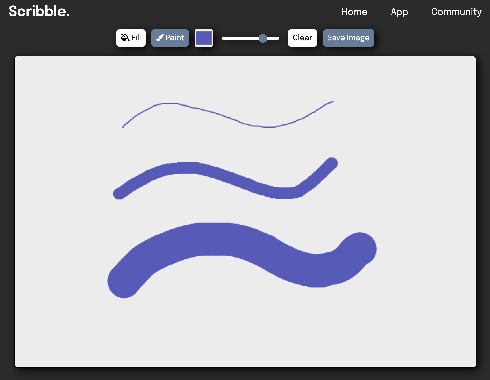
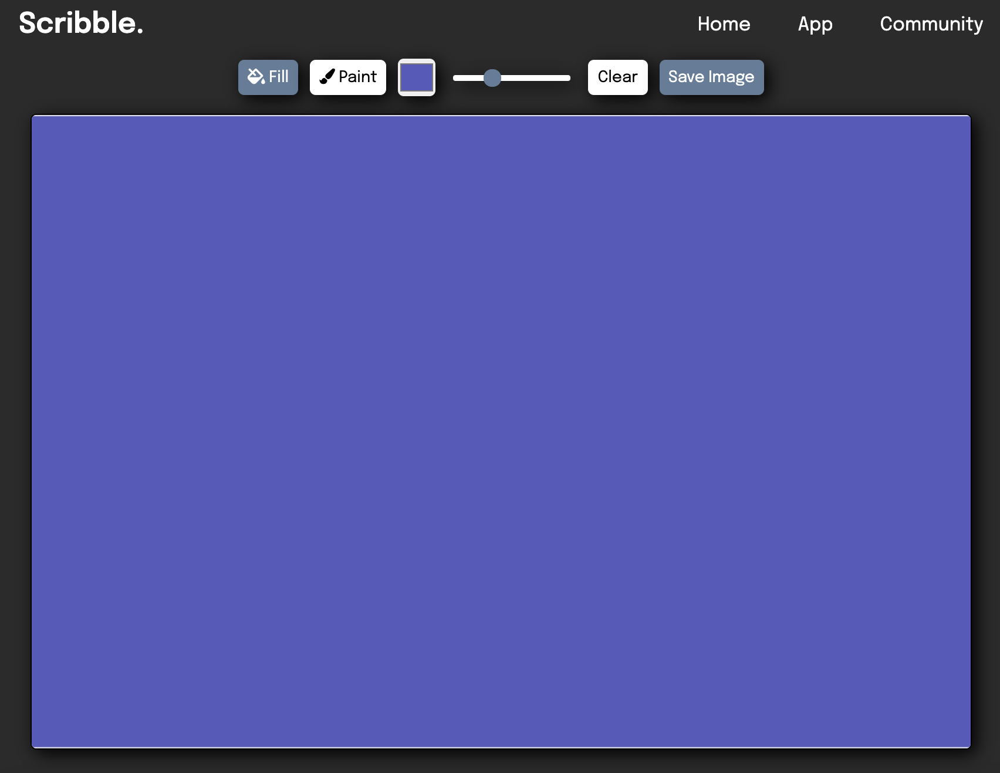

# Scribble.
### By [Donovan Gallaway](https://www.linkedin.com/in/donovan-gallaway/) and [Sarah Carter](https://www.linkedin.com/in/scarterwebdev/)

[Visit the live site!](https://reverent-goodall-68ffa0.netlify.app/)

## Introduction
This project is a submission for the Mintbean Hiring Hackathon. The goal of the Hackathon was to build an app that lets people express their creativity in a visual format. Together, we created a React-based drawing app that allows the user to draw their very own masterpiece in their browser. To make the app full-stack, we created an Express API which utilizes a MongoDB database to store user creations so that they can be displayed on our Community page.

## How to Draw
After navigating to the App page, users can start creating the next Mona Lisa by dragging their mouse along the canvas. Change the brush width, the paint color, or use the fill tool, the choice is up to the artist! Once the painting is completed, share it to the Scribble gallery by clicking the Save Image button. It will then be added to the community page.

[Check out the tutorial video here!](https://youtu.be/PUAebzoZHZY)

#### Change the color and width of the brush:

After clicking the Paint button, change the color but clicking and using the color picker. Users can also change the width of their brush by dragging the slider.

#### Use the fill tool to fill spaces with a color:

After clicking the Fill button, pick a fill color from the color picker and click anywhere on the canvas to fill the desired space.

## Technologies Used
Frontend:
- React
- react-router-dom
- Sass

Backend:
- Express
- Node
- MongoDB

[Backend Repo](https://github.com/DonovanGallaway/notms-paint-backend)

## Components/Pages
- Header
- Footer
- Home
- Canvas
- Community

## React Component Architecture
```
-> App
    -> Header
    -> Routes
        -> Route |path:"/"|
            -> Home
        -> Route |path:"/draw"|
            -> Canvas 
        -> Route |path:"/community"|
            -> Community
    -> Footer
```

## User Stories
- As a user, I can drag my mouse across the screen to make free-form lines.
- As a user, I can click the different pen tools in the toolbar to change the color or thickness of the line.
- As a user, I can use the fill tool to fill spaces of the canvas.
- As a user, I can save my art using the Save Image button and see it posted on the Community page.
- As a user, I can clear the canvas by clicking the Clear button.

## Available Scripts

In the project directory, you can run:

### `npm start`

Runs the app in the development mode.\
Open [http://localhost:3000](http://localhost:3000) to view it in the browser.

The page will reload if you make edits.\
You will also see any lint errors in the console.